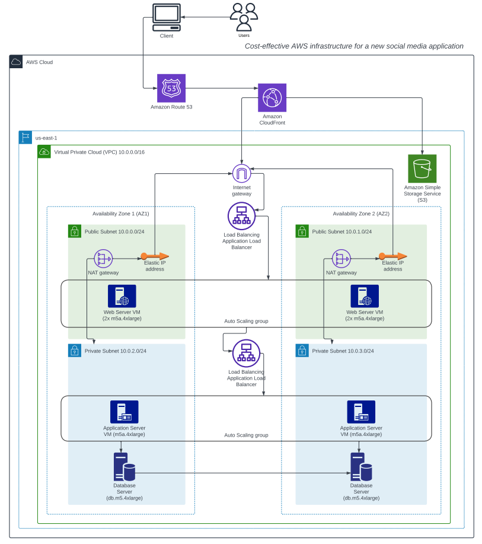
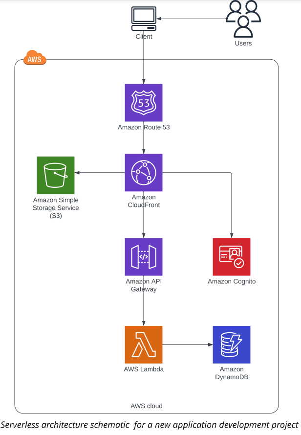
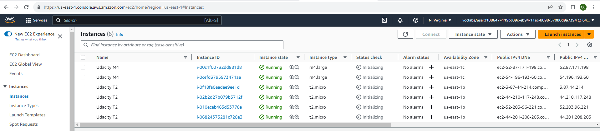
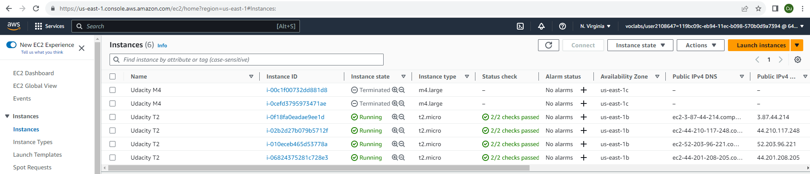
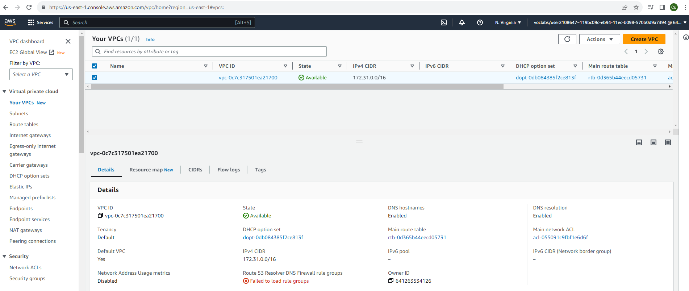
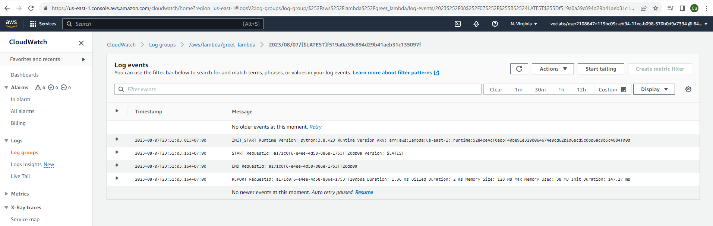
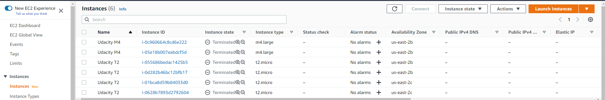

# Project Details Design, Provision and Monitor AWS Infrastructure at Scale
In this project, you will plan, design, provision, and monitor infrastructure in AWS using industry-standard and open source tools. You will practice the skills you have learned throughout the course to optimize infrastructure for cost and performance. You will also use Terraform to provision and configure AWS services in a global configuration.

### Task 1: Create AWS Architecture Schematics
1. Cost effective AWS infrastructure schematic 

For reading pdf file. Please click [Udacity_Diagram_1.pdf](Udacity_Diagram_1.pdf)
 

2. Serverless Architecture schematic 

For reading pdf file. Please click [Udacity_Diagram_2.pdf](Udacity_Diagram_2.pdf)

### Task 2: Calculate Infrastructure Costs
1. For reading `Initial_Cost_Estimate.csv` file. Please click [Initial_Cost_Estimate.csv](Initial_Cost_Estimate.csv)
2. For reading `Reduced_Cost_Estimate.csv` file. Please click [Reduced_Cost_Estimate.csv](Reduced_Cost_Estimate.csv)
3. For reading `Increased_Cost Estimate.csv` file. Please click [Increased_Cost_Estimate.csv](Increased_Cost_Estimate.csv)

### Task 5 : Use Terraform to Provision AWS Infrastructure
1. Screenshot of the 6 EC2 instances
    

2. Screenshot of the 4 t2.micro instances
    

3. Screenshot of the VPC
    

4. Screenshot the CloudWatch log entry for the lambda function execution
    

5. Destroy the Infrastructure using Terraform
    